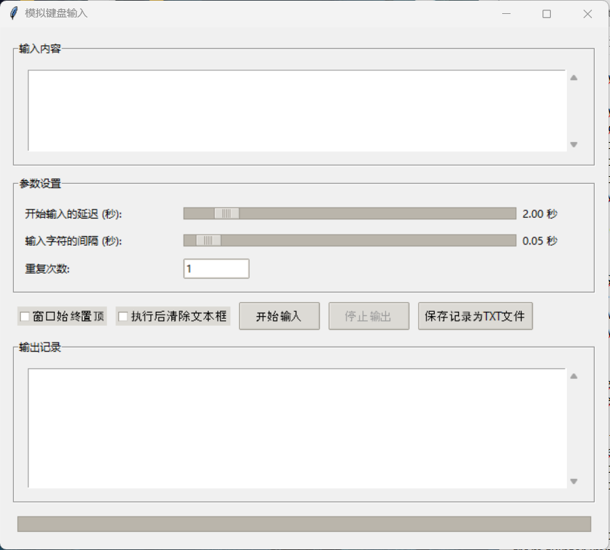

# 键盘输入模拟器

## 简介

键盘输入模拟器是一款带有图形用户界面（GUI）的应用程序，能够模拟真实的键盘输入行为。该工具特别设计用于绕过某些平台（例如学习通）的防粘贴机制，使得自动化文本输入成为可能。

## 特性

- 带有直观的图形用户界面。
- 模拟真实键盘输入，可以有效绕过检测机制。
- 简单易用，适合需要频繁输入文本的场景。

## 安装与使用

### 安装依赖

在开始之前，请确保您的环境中已经安装了`pynput`库。可以通过以下命令进行安装：

```bash
pip install pynput
```

### 使用说明

1. 启动应用程序。
2. 在界面上点击“开始输入”按钮。
3. **重要**：请立即手动将鼠标移动到目标输入框并点击它，以确保模拟输入能够正确地在您希望的位置开始。




